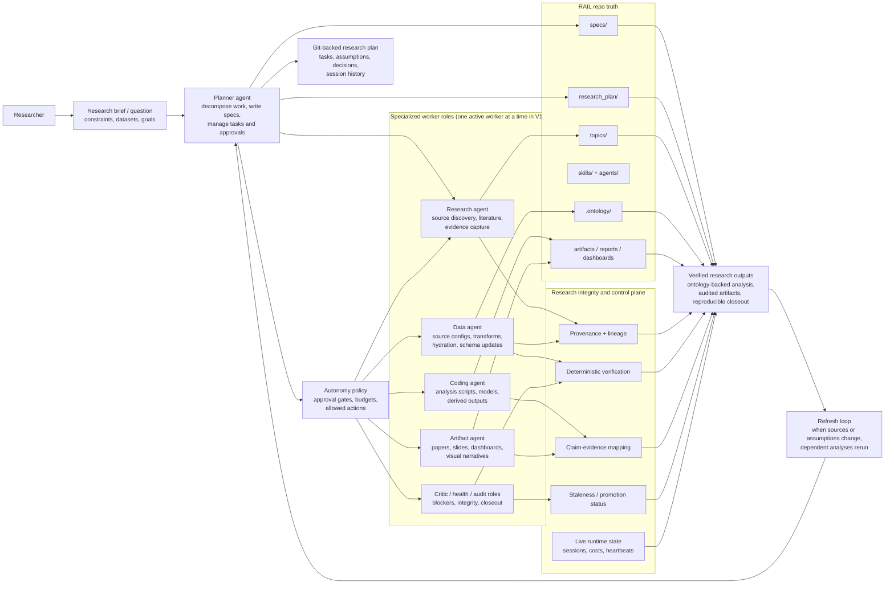

# Co-Scientist Mode in RAIL

This document explains the hypothesis-first additions for larger end-to-end research runs.

## How RAIL differs from the Co-Scientist vision

The reference Co-Scientist system is centered on generating, debating, ranking, and refining hypotheses.
RAIL can borrow that loop, but its core vision is broader and more operational:

- **Co-Scientist is hypothesis-first.** Its center of gravity is idea generation, critique, and scientific ranking.
- **RAIL is research-system-first.** Its center of gravity is turning a question into a durable, Git-backed, ontology-backed research project.
- **Co-Scientist emphasizes concurrent specialized reasoning agents.** RAIL V1 emphasizes a **planner-controlled sequential workflow** with one active worker at a time.
- **Co-Scientist focuses on proposal quality.** RAIL focuses on **proposal quality plus data ingestion, ontology growth, reproducibility, lineage, evidence gates, and closeout audits**.
- **Co-Scientist outputs research hypotheses and overviews.** RAIL is meant to produce **hydrated data assets, ontology state, scripts, analyses, artifacts, task history, and verification records**.
- **Co-Scientist assumes an agentic research loop.** RAIL adds a stronger **control plane**: autonomy modes, approval boundaries, path allowlists, isolated workspaces, and promotion gates.

In short: Co-Scientist is a multi-agent research ideation engine. RAIL is a Git-native autonomous research operating system that can include a Co-Scientist-style hypothesis loop inside a larger evidence-gated workflow.

## RAIL system graphic



## Read the diagram

1. The researcher gives RAIL a question, constraints, and target outputs.
2. The planner turns that into repo-backed specs and tasks.
3. Specialized workers execute bounded tasks inside an autonomy policy.
4. Data work updates the ontology and hydration state; research and coding work produce evidence and analysis.
5. Integrity checks decide what is exploratory, verified, blocked, or stale.
6. Only outputs that pass those gates are promoted as trusted artifacts.
7. When sources or assumptions change, RAIL reruns the affected downstream work instead of starting from scratch.

## What was added

- **Hypothesis portfolio** in `research_plan/state/hypotheses.json`
- **Critic review loop** that writes blocker conflicts and claim candidates
- **Ranking and prioritization** signals for hypothesis-linked task selection
- **Research burst controls** in `rail.yaml` (`research_burst.enabled`, `max_parallel`, `max_cost_usd`)
- **Meta-synthesis template** at `artifacts/meta_synthesis.md`

## Hypothesis workflow

1. Create hypotheses via API (`POST /api/v1/projects/{slug}/hypotheses`) or Integrity UI panel.
2. Link each hypothesis to claim keys and task IDs.
3. Run critic review (`POST /api/v1/projects/{slug}/critic/review`) to identify blockers.
4. Resolve claim evidence gaps and update hypothesis status.
5. Use ranked hypotheses in closeout synthesis and next-task prioritization.

## Critic gate behavior

- Hypotheses marked `weakened` or `rejected` are treated as promotion blockers when linked claims appear in an artifact.
- Promotion gate reasons include critic blocker messaging until those hypotheses are resolved or archived.

## Research burst behavior

- Burst execution is capped by manifest limits.
- Each burst creates angle-specific draft hypotheses and corresponding research tasks.
- Session launch is bounded to configured maximum parallelism and never unbounded.

## E2E smoke run

Use:

```bash
./scripts/e2e_research_smoke.sh docs/validation/ontology-first-public
```

This validates manifest loading, required integrity state files, and verification script wiring.
